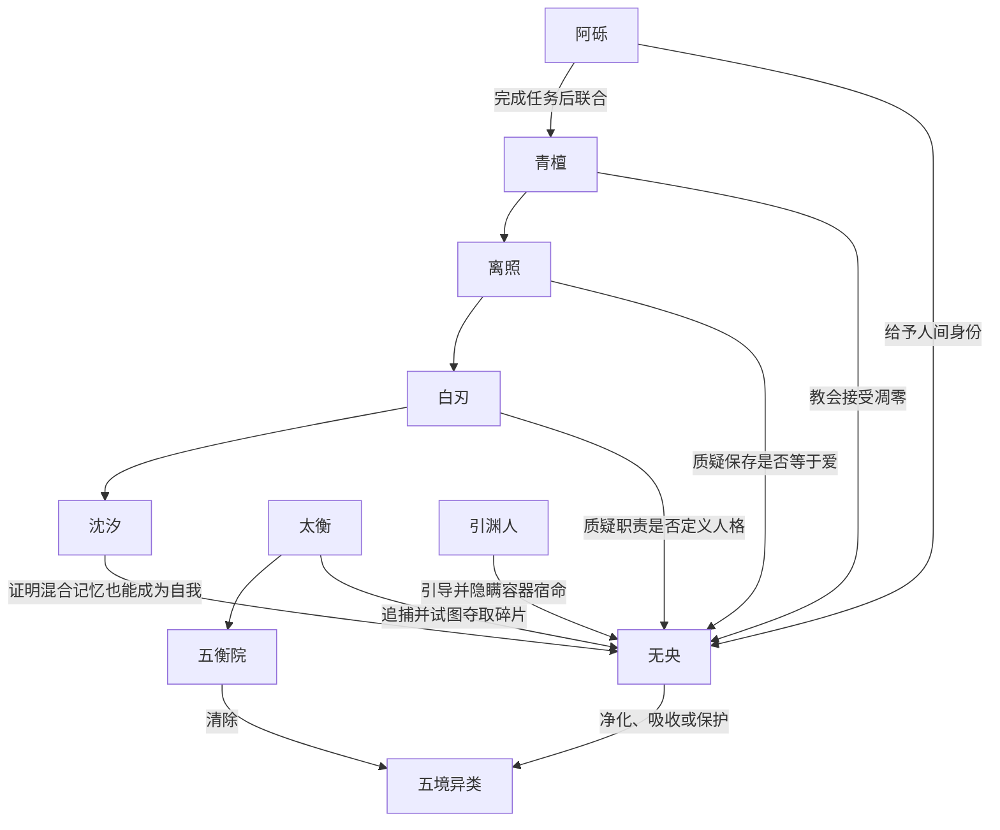
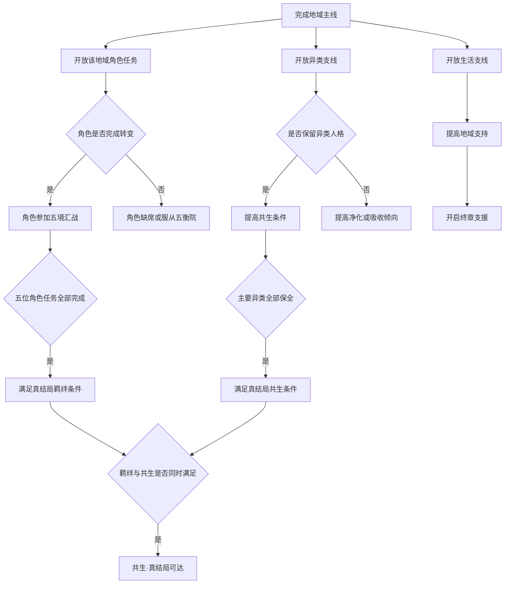

# 《Five Land》角色与任务规划

## 1. 角色设计原则

- 每位主要角色都代表本境拒绝承担的一种代价。
- 角色不是五行概念的讲解者，他们先以职业、家庭和具体困境进入剧情。
- 个人任务会改变终章行动和结局，而不是只提供装备奖励。
- 异类角色保留欲望、关系和选择能力，不被统一写成怪物或受害者。

## 2. 主角与核心对立者

### 无央

- 身份：由五枚本源碎片与归墟残余记忆形成的人形容器。
- 表层目标：寻找自己的来历，停止蔓延至五境的腐败。
- 深层矛盾：她是否拥有独立人格，还是世界为了自救制造的一件工具。
- 角色变化：从模仿他人的情感，到主动选择自己愿意承担的代价。
- 战斗表现：唯一能够切换全部五行架势的人；吸收腐败会改变技能外观和部分招式。

### 太衡

- 身份：五衡院首领，五境封印体系的维护者。
- 目标：夺取无央体内的碎片，继续由五衡院控制循环。
- 信念：一次性归还数百年的衰败会摧毁文明，因此有限的谎言和牺牲是必要的。
- 作用：他掌握真实历史，不否认罪行，也不是腐败的化身；其危险来自把所有生命都视作可计算成本。
- 终章变化：五位地域角色若完成个人任务，会逐项推翻太衡关于“民众无法承担真相”的论证。

### 引渊人

- 身份：上一代修复容器消散后留下的人格残响。
- 目标：引导无央重复“收集碎片并归还自身”的旧方案。
- 矛盾：他真心想拯救世界，却已无法想象容器可以作为人继续存在。
- 揭示方式：在每次本源记忆后出现，形体逐渐与无央相似。

## 3. 五位主线角色

### 阿砾·土境送葬人

- 登场：在墟门发现并藏匿无央。
- 性格：务实、克制，习惯用墓契确认每个人的位置。
- 个人矛盾：其家族世代替五衡院修改墓契，连他关于父母的记忆也是伪造的。
- 角色任务：找回三块被凿去姓名的墓碑，决定公开还是再次掩埋家族罪行。
- 终章作用：完成任务后组织送葬人打开土境古道，并为无央记录一个不由出身决定的新名字。

### 青檀·木境医师

- 登场：治疗被寄生花缠绕却仍能说话的病人。
- 性格：温和、精确，对“救活所有人”有近乎固执的执念。
- 个人矛盾：她一直用母树延续妹妹的意识，正是腐败持续扩张的节点之一。
- 角色任务：寻找妹妹散落在森林中的记忆种子，决定让其凋零或继续寄生。
- 终章作用：完成任务后接受死亡是治疗的一部分，引导木境主动修剪母树。

### 离照·火境巡火队长

- 登场：奉命追捕无央，后因发现五衡院抽取余烬而暂时合作。
- 性格：直接、守诺，认为记住死者就是继续爱他们。
- 个人矛盾：他的家族记忆寄存在不熄炉中，关闭炉心意味着亲手让家人消逝。
- 角色任务：护送最后一束家火穿越灰誓道，并让幸存者亲口讲述而非依赖余烬。
- 终章作用：完成任务后熄灭圣火，带领巡火队为五境汇战开路。

### 白刃·金境逃亡铸工

- 登场：因私自取回姓名而被白铸城邦追捕。
- 性格：敏锐、讽刺，面对情感时反而笨拙。
- 个人矛盾：他的情感已被铸成一把衡刃；取回情感会失去赖以生存的武器能力。
- 角色任务：寻找衡刃的三名历代使用者，确认其中混合了多人的人格。
- 终章作用：完成任务后熔毁衡刃，让铸工停止制造五衡院军队。

### 沈汐·水境记忆潜游者

- 登场：从无央的倒影中认出上一代容器。
- 性格：善于理解他人，却无法稳定使用“我”来描述自己。
- 个人矛盾：她拥有数百人的记忆，原初人格可能早已消失。
- 角色任务：归还三段被盗记忆，并选择保留混合后的自我，而不是寻找唯一真身。
- 终章作用：完成任务后让被篡改的历史流入五境公共水镜，迫使五衡院失去叙事控制。

## 4. 主要人物关系

## 5. 主线任务角色职责

| 阶段 | 推动角色 | 对立角色 | 玩家获得的信息 |
|---|---|---|---|
| 序章 | 阿砾、引渊人 | 墟门衡吏 | 五衡院在向归墟倾倒废弃物 |
| 木境 | 青檀 | 母树祭司 | 没有凋零的相生会转化为腐败 |
| 金境 | 白刃 | 天衡官 | 五衡院将情感铸成统治工具 |
| 火境 | 离照 | 太衡 | 腐败来自五境拒绝承担代价 |
| 水境 | 沈汐 | 观忆院 | 历史曾被修改，上一代容器被抹除 |
| 土境深层 | 阿砾 | 墓契宗族 | 五境稳定建立在被删除者之上 |
| 终章 | 五位地域角色 | 太衡、引渊人 | 修复旧循环并非唯一答案 |

## 6. 支线任务角色

每境设置两条代表性角色支线：一条呈现普通生活，一条处理仍保有人格的异类。主要支线总量为十条。

### 木境

#### 苔七：借来的春天

菌农苔七用寄生花保存病逝伴侣的声音。玩家调查后发现花只是在重复最后一日，而苔七一直没有继续生活。选择让花凋零可提高“循环”；保留一枚不会扩散的种子可同时推进“共生”。

#### 槐娘：长在屋中的人

槐娘与住宅巨树融合，无法移动，却仍照顾整条街的孩子。五衡院要求焚毁她。玩家可疏导根系并证明她保有人格，使其在终章保护枝城居民。

### 火境

#### 烬童：最后一句话

孤儿烬童靠替人保管余烬谋生，却私自修改死者留言来安慰家属。玩家需寻找真实遗言，并决定真相应如何被交还。

#### 炉婆：不肯冷却的手

老陶匠炉婆的双手已化为火焰。她需要水境冷泉才能停止疼痛，却害怕失去制陶能力。完成任务后，她会制造不依赖永久火焰的储忆陶片。

### 土境

#### 石禾：无墓之田

农人石禾把无墓者骨灰混入田地，因此庄稼异常繁盛。宗族要求毁田。玩家可为无名者建立共同墓契，使村民承认土地不只属于登记家族。

#### 缄伯：碑兽的名字

缄伯逐渐石化并与碑兽共享感觉。他请求玩家找回自己被凿去的姓名。保留其共生状态后，碑兽群会在终章搬开封堵古道的石墙。

### 金境

#### 铃九：第十种工作

修铃匠铃九暗中从事身份登记外的音乐创作。玩家帮助她拆除身份铃的监听结构后，铃镇居民开始用不规则音律表达情绪。

#### 余锋：会害怕的剑

退役兵器余锋已经产生人格，并拒绝再次杀人。玩家可将其熔毁、交还军队或帮助其取得非战斗用途。保护余锋可推进“共生”。

### 水境

#### 泊生：不存在的童年

船夫泊生发现自己的童年属于一名失踪者。玩家归还记忆后，他可以保留由这段经历形成的感情，但必须停止冒充失踪者生活。

#### 镜姑：许多人的梦

镜姑由公共水镜中的残余梦境形成，没有原始身体。观忆院要将她排空。玩家帮助她建立稳定记忆锚点后，她会在终章保存无央的人格。

## 7. 任务依赖与真结局流程

## 8. 终章角色状态

- 阿砾决定无央是否能获得属于自己的姓名与人间记录。
- 青檀决定木境是否主动承担凋零，而非被迫毁灭。
- 离照决定火境军队支持五衡院还是护送平民进入古道。
- 白刃决定金境铸工是否继续生产无感军队。
- 沈汐决定被隐藏的历史能否同时传至五境。
- 镜姑若被保全，会在归墟核心保存无央的人格锚点。
- 其他异类决定五境是否有能力把腐败转化为可共处的衰亡阶段。
