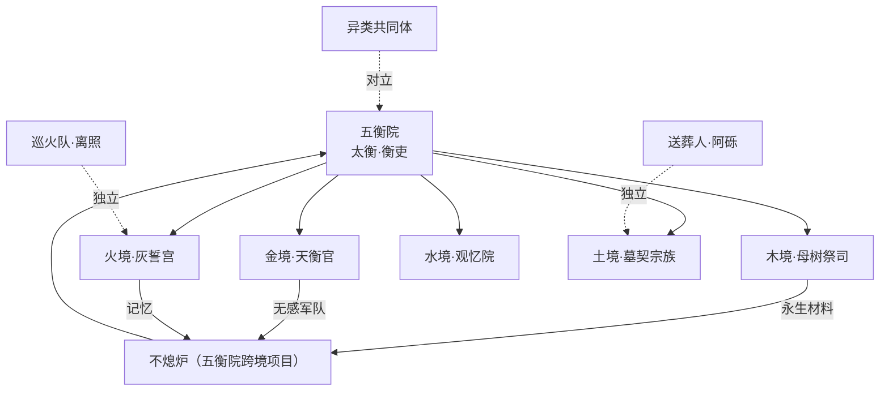

# 势力与阵营

## 1. 总览

五境统治者共同建立五衡院，各境本地机构是统治者本体，五衡院是联合执行机构。本表定义各势力的目标、秘密、与无央的关系与终章立场。

## 2. 五衡院

- **结构**：太衡（首脑）→ 衡吏（各地执行）→ 天衡官（金境军务）→ 观忆院（水境历史管理，直属五衡院而非水境本地）。
- **目标**：维持封印、延续五境繁荣、掩盖倾倒真相。
- **秘密**：① 腐败来自五境自身而非归墟；② 容器计划（以碎片缝合人形，失败一次）；③ 不熄炉跨境抽取（木境生命、金境情感、火境记忆）。
- **与无央关系**：追捕并试图夺取碎片（太衡），衡吏为序章与各境对立角色。
- **终章作用**：五衡院军队与幸存者、异类同赴归墟；太衡决战（见 monster-bestiary 太衡战斗形态）。

## 3. 五境势力

| 势力 | 境 | 首领/代表 | 目标 | 秘密 | 终章立场 |
|---|---|---|---|---|---|
| 母树祭司 | 木 | 祭司团（青檀的对立面） | 维持母树永生、延续无秋 | 母树以活人记忆维持，祭司是共谋 | 青檀任务完成后转向支持凋零 |
| 天衡官 | 金 | 天衡官（白刃对立面） | 维持职业制度、供应无感军队 | 情感铸造成军队，天衡钟是记录中枢 | 白刃熔毁衡刃后铸工停止供军 |
| 灰誓宫 | 火 | 火境统治者 | 维持国葬与圣火 | 不熄炉抽取本境记忆 | 离照熄灭圣火后护送平民 |
| 观忆院 | 水 | 观忆人 | 管理公共记忆、抹除不利历史 | 抹除第一代容器失败记录 | 沈汐任务完成后失去叙事控制 |
| 墓契宗族 | 土 | 宗族长老（阿砾对立面） | 以墓契维持血脉秩序 | 世代修改墓契、封存不服从者 | 阿砾公开真相后分裂 |
| 送葬人 | 土 | 阿砾 | 跨越阶层执行送葬、保存被隐藏历史 | 部分送葬人知道墓契伪造 | 打开土境古道（阿砾任务完成） |
| 巡火队 | 火 | 离照 | 传递祖火、护送商队 | 家族记忆寄存不熄炉 | 为五境汇战开路 |
| 异类共同体 | 跨境 | 领袖候选：槐娘或缄伯 | 争取「被接受而非被清除」 | 部分异类确实危险（见 narrative-differentiation 第 5 节） | 终章保护古道与居民、保存无央人格（镜姑） |

## 4. 跨境关联（「交织」示例）

章节任务可以跨境交织，以下为已确认的隐藏关联，供后续章节细化时使用：

- **不熄炉项目**：木境母树祭司向五衡院输送「永生材料」（活人记忆提取物），金境天衡官输送无感军队，火境灰誓宫提供余烬记忆——三境各自的腐败症状（不凋零、无情感、不熄灭）都直接服务于同一个设施。木境与金境主线的「拒绝相克」其实是同一个项目的两面。
- **天衡钟的铸造**：天衡钟铸造时融入了木境母树的树髓与土境墓契的墨料——钟不只是金境的记录中枢，而是五衡院跨境的「账本」。
- **送葬人与观忆院**：土境墓契与金境身份铃的删除记录会定期交给观忆院统一抹除——被删除者的历史在五境间流动，证据板系统（quest-structure-differentiation）收集的证据正是这些被抹除的痕迹。
- **引渊人与各境**：第一代容器当年收集碎片时曾在五境留下记录，观忆院抹除了大部分，但送葬人、铸工、巡火队各自保留了一块残片——无央在五境旅行时收集的残响图鉴，本质上是在拼回第一代容器的历史。

## 5. 势力间的力量平衡

- 五衡院依赖各境供应（生命、情感、记忆）维持不熄炉；断供链是终章之前玩家行为（完成角色任务）的主要破坏目标。
- 异类共同体无武装，靠保护者（巡火队部分成员、送葬人）与地形（碑兽峡、槐娘的根系）生存。
- 无央不是任何势力的成员：她在序章获得「阿砾所属·待验」的临时身份，各境身份均为暂借。

## 6. 验收标准

- [ ] 任何新章节剧情可回答「本境对立势力是谁、它的秘密是什么、断供它需要完成哪个角色任务」。
- [ ] 跨境关联（不熄炉、天衡钟、观忆院抹除链）不与其他文档冲突。
- [ ] 异类共同体有明确领袖候选与其诉求台词（见 narrative-differentiation 第 3 节）。
