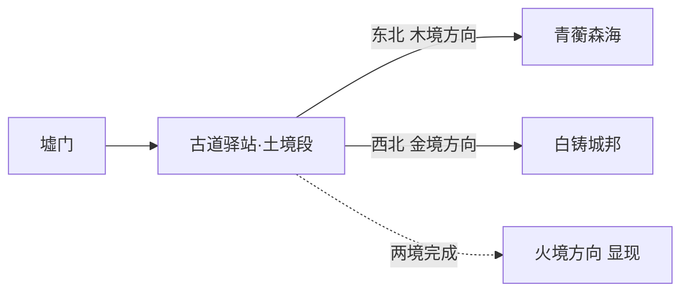

# 五行古道与选路设计

## 1. 定位与问题

序章完成后（`prologue_complete=true`），玩家从墟门出发进入第一幕，需在木境与金境之间选择先后。当前设定缺口：选择载体、过渡节点、与既有检查点/快速返回系统的衔接均未定义。

设计目标：

- 选择必须**顺序无关**（先木后金 / 先金后木都成立，见 `woodland-quests.md` 与 `goldland-quests.md` 交织点）。
- 选择要有**世界感**——玩家是在一条真实存在的古道上做决定，不是打开菜单点两个按钮。
- 完成后要有**可见反馈**——两境都完成时，通往火境的路显现。

## 2. 五行古道结构

五行古道是五境共同修建、后来主动封闭的环形道路（world-map-and-art 第 1 节），连接五境与归墟。序章出口位于土境古道段：

### 古道驿站（新节点）

序章与第一幕之间的过渡点，位于墟门外古道岔口：

- 外观：石亭 + 篝火 + 三向路标（东北/西北/封死的东南向）。
- 功能：存档点、证据板查看、快速返回墟门（衔接 `xumen-prologue-return-paths.md` 检查点体系）、选路。
- 叙事功能：阿砾在此与无央分别（「我送你到这里。上面的路，你自己挑。」），驿站是序章与第一幕的情感转折点。

## 3. 选路交互

### 3.1 物理岔路（主载体）

- 两条真实可走的古道支路，向东北与西北延伸。
- 每条路设路标与远景方向标志：木境方向可远眺枝城主干树冠层，金境方向可远眺天衡塔尖（方向标志规范见 `entity-definition-guide.md` 第 2 节）。
- 走错方向可在驿站折返，无惩罚——选路不是谜题，是表达。

### 3.2 世界地图（辅助载体）

- 驿站石亭内可打开世界地图（五行环布局，见第 5 节）。
- 已解锁区域可快速旅行；未解锁区域显示「路未通」。
- 地图快速旅行与物理行走共用同一状态，不产生双轨存档。

### 3.3 火境方向

- 木境与金境均完成（`MU-P06` 与 `JI-P06` 完成）后，驿站东南向的路障移除、路标点亮。
- 场景表现：封路石墙上的藤蔓枯萎、路标「火境·赤烬原」显字。

## 4. 状态与衔接

| 状态 | 表现 |
|---|---|
| 序章完成、未走任何一境 | 三向路标：东北（木）、西北（金）、东南（封死） |
| 完成木境 | 木境方向路标变色（落叶标记），金境方向照常 |
| 完成金境 | 金境方向路标变色（铸造纹），木境方向照常 |
| 两境完成 | 东南火境方向显现，路障移除 |
| 第二幕完成 | 驿站新增水境/土境深层方向（第三幕同理） |

- 驿站复活点：死亡后从最近检查点或驿站重试（沿用既有检查点规则，不重复发放奖励）。
- 快速返回：驿站 ↔ 墟门双向快速返回，解锁条件沿用 `FL-S02` 奖励（墟门检查点快速返回）。

## 5. 世界地图界面规格

- 布局：五行环（北水、东北木、东南火、西南土、西北金），中央为归墟（world-map-and-art 第 1 节方位）。
- 状态标记：当前区域高亮、已完成区域盖印章（国风「勘合」印）、未解锁区域墨色虚化。
- 快速旅行：点击已解锁区域确认后进入读取过渡（黑幕 + 路标渐显）。
- 界面风格：旧纸墨线 + 朱砂印，符合 `ui-spec.md` 国风纸墨原则。
- 无障碍：地图标记同时有文字与形状（虚化/印章/高亮），不依赖颜色。

## 6. 与章节任务的衔接

- 驿站是 `MU-P01`（落叶问诊）与 `JI-P01`（没有名字的人）的共同起点——两任务触发区在各自境内入口，不进驿站。
- 阿砾的分别台词只在第一次到驿站时播放；后续到驿站为纯功能节点。
- 若玩家在完成两境前返回驿站，无额外事件（防止状态漂移）。

## 7. 验收标准

- [ ] 选路不产生任何顺序依赖，先木后金与先金后木均完整可玩。
- [ ] 火境方向仅在两境完成后显现，无提前进入路径。
- [ ] 驿站存档/证据板/快速返回三项功能与既有检查点规则一致。
- [ ] 世界地图五行环方位与 `world-map-and-art.md` 一致，未解锁区域不可快速旅行。
- [ ] 阿砾分别台词仅播放一次，驿站后续为功能节点。
