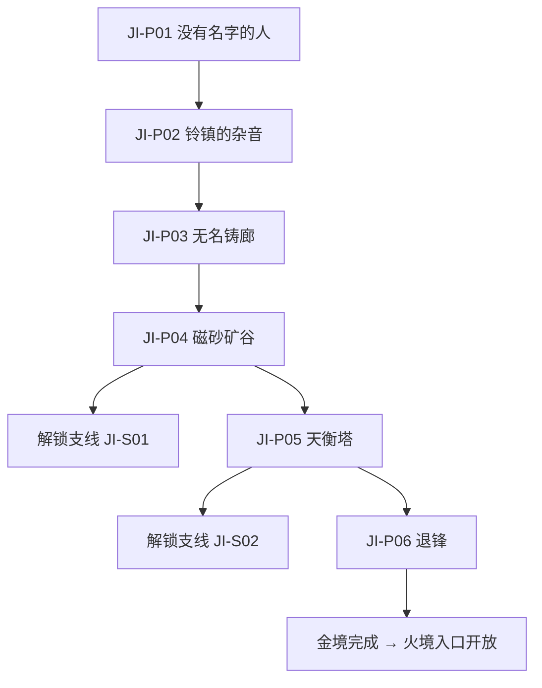

# 金境任务规划（第一幕·白铸城邦）

## 1. 范围与 ID 规范

- 主线时长：6–8 小时（含支线）。
- 地点：白垣城、铃镇、磁砂矿谷、无名铸廊、天衡塔。
- 任务 ID 前缀：金境主线 `JI-P01` 起，支线 `JI-S01` 起（规范见 `woodland-quests.md` 第 1 节）。
- 教学目标：火克金破稳与处决（活器、磁砂铁偶、无感卫队、天衡钟）、潜入与伪装（身份铃）、证据板消费。
- 剧情目标：揭示「五衡院将情感铸成统治工具」，认识白刃，与木境埋下跨境交织线索。
- 交织说明：金境任务与木境互为先后均可完成，两境互埋线索、顺序无关（见第 7 节）。

## 2. 主线总表

| ID | 任务名 | 预计时长 | 起点 | 完成条件 | 核心产出 |
|---|---|---|---|---:|---|
| JI-P01 | 没有名字的人 | 30 分钟 | 白垣城 | 获得临时职业代号 | 认识白刃，了解身份铃 |
| JI-P02 | 铃镇的杂音 | 40 分钟 | 铃镇 | 改装「无名铃」 | 潜入伪装工具 |
| JI-P03 | 无名铸廊 | 50 分钟 | 无名铸廊 | 潜入并发现情感铸造真相 | 天衡钟树髓揭示（木境交织） |
| JI-P04 | 磁砂矿谷 | 50 分钟 | 磁砂矿谷 | 截获运输记录 | 永生材料流向（木境交织） |
| JI-P05 | 天衡塔 | 1–1.5 小时 | 天衡塔 | 击败天衡钟 | 金境主线收束 |
| JI-P06 | 退锋 | 30 分钟 | 白垣城 | 看完代价镜头 | 金架势「契力」开放 |

## 3. 主线流程

## 4. 主线任务明细

### JI-P01：没有名字的人

- **前置**：完成序章，抵达金境入口。
- **触发器**：进入白垣城。

**步骤**：

1. 白垣城入口：无央没有职业代号，被身份铃盘查（「没有名字的人不得入城」）。
2. 逃亡铸工白刃被天衡官追捕，混入盘查现场；他以「学徒」身份帮无央登记临时代号。
3. 白刃介绍身份铃制度：成年人以职业代号替代姓名，身份铃记录职责与工作年限。
4. 无央获得「外来匠徒」临时代号，白刃要求她帮忙毁掉天衡钟。

**关键对白**：

- 白刃：「我没有名字。我把它偷回来了——所以他们追我。」
- 无央（模仿白刃的讽刺口吻）：「偷回自己的名字，算第几种工作？」

**失败与重试**：无战斗；盘查选择只影响入城台词。

**完成结果**：解锁 `JI-P02`；证据板新增「白刃的衡刃」条目。

### JI-P02：铃镇的杂音

- **前置**：完成 `JI-P01`。
- **触发器**：与白刃一起进入铃镇。

**步骤**：

1. 铃镇制造身份铃与精密零件；调查发现身份铃带监听结构（铃九支线入口，主线只取改装需求）。
2. 白刃改装一枚「无名铃」给无央——铃不记录职责，只记录杂音（不规则音律，见 `JI-S01`）。
3. 战斗教学：活器（固定节奏三连锤）——火克金破稳；执念闪现：它反复敲打的是一段乐曲的开头。
4. 无名铃使无央可伪装成不同职业潜入（身份铃伪装机制，quest-structure-differentiation 金境骨架）。

**关键对白**：

- 白刃：「铃是给城邦听的。这枚铃，只给你自己听。」

**失败与重试**：死亡从铃镇入口重试。

**完成结果**：解锁 `JI-P03` 与残响收集（铃镇 2 段）。

### JI-P03：无名铸廊

- **前置**：完成 `JI-P02`。
- **触发器**：以伪装身份潜入无名铸廊。

**步骤**：

1. 潜入（伪装身份铃）：铸廊将「不必要的情感」铸成器具——活器工人机械重复劳作。
2. 发现天衡钟的铸造记录：钟身融入了母树树髓与墓契墨料（交织点 A，见第 7 节）。
3. 发现五衡院用铸出的情感制造无感军队（核心揭示）。
4. 白刃确认：毁掉天衡钟 = 停止军队生产 + 让被记录的名字自由。

**关键对白**：

- 白刃：「钟里记着所有人的职责。包括那些被删掉的名字——它们也在钟里，只是没人敢看。」

**失败与重试**：潜入失败（被发现）从铸廊入口重试，伪装不丢失。

**完成结果**：解锁 `JI-P04`；证据板新增「无感军队」与「天衡钟铸材」。

### JI-P04：磁砂矿谷

- **前置**：完成 `JI-P03`。
- **触发器**：进入磁砂矿谷。

**步骤**：

1. 磁砂矿谷：武器被地形牵引，磁砂铁偶巡矿（火克金破稳教学第二应用）。
2. 截获五衡院运输记录：木境的「永生材料」、火境的记忆样本持续运往「不熄炉」（交织点 B：与木境 `MU-P04` 记忆流向呼应）。
3. 记录显示不熄炉抽取三境本源——金境提供的是无感军队（factions 不熄炉项目）。

**关键对白**：

- 白刃：「我以为只有金境在卖命。原来整个五衡院，都在喂同一个炉子。」

**失败与重试**：死亡从矿谷入口重试。

**完成结果**：解锁 `JI-S01` 与 `JI-P05`。

### JI-P05：天衡塔

- **前置**：完成 `JI-P04`。
- **触发器**：潜入天衡塔。

**步骤**：

1. 潜入天衡塔（身份铃伪装 + 无感卫队战：列阵冲锋/职责标记/无感合击）。
2. 天衡钟首领战（机关型：报时震荡/职责点名/天衡坠落，见 monster-bestiary 4.4）。
3. 天衡钟毁——钟壁崩落，露出铸钟匠轮廓（执念闪现：他把自己铸进钟里，「让钟记得职责之外还有人」）。
4. 铸工停止制造无感军队（金境主线收束）。

**关键对白**：

- 残响（天衡钟终结时）：「记不住名字的城，最后连钟都记不住自己。」

**失败与重试**：死亡从天衡塔入口重试；首领生命与场地恢复。

**完成结果**：解锁 `JI-S02` 与 `JI-P06`；若玩家先完成木境，白刃会提及「母树的树髓终于断了」（交织点 A 闭环）。

### JI-P06：退锋

- **前置**：击败天衡钟。
- **触发器**：返回白垣城。

**步骤**：

1. 代价镜头「金境·退锋」（story-cost-beats 3.2）：老铸工失去身份铃的秩序感，站在空炉前反复说「我记不得自己第几年做工了」。
2. 帮助老铸工登记新名（循环 +1）或离开。
3. 白刃的个人任务起点（衡刃的三名历代使用者，任务线另文档细化——衡刃与天衡钟分离，见 monster-bestiary 4.4 联动说明）。
4. 无央获得金架势「契力」（combat-system-spec 3.4）。

**关键对白**：

- 白刃：「没有铃，他连自己是谁都不知道。」（停顿）「那就从现在开始记。」

**完成结果**：金境完成，火境入口开放；若木境未完成，可自由前往木境。

## 5. 金境支线

### JI-S01：铃九·第十种工作

- **接取条件**：完成 `JI-P02`，尚未进入天衡塔。
- **委托人**：修铃匠铃九。
- **目标**：拆除身份铃的监听结构。

**步骤**：

1. 铃九暗中从事身份登记外的音乐创作——「第十种工作」。
2. 帮她拆除身份铃监听结构（小机关解谜，火克金熔断监听芯）。
3. 完成后铃镇居民开始用不规则音律表达情绪（循环 +1，聚落状态机联动）。

**奖励**：契铁屑 ×2。

### JI-S02：余锋·会害怕的剑

- **接取条件**：完成 `JI-P05`。
- **委托人**：退役兵器余锋。
- **目标**：决定一柄产生人格的剑的去向。

**步骤**：

1. 余锋拒绝再次杀人，是天衡钟毁后第一批恢复情感的「活器」。
2. 三选一：熔毁（净化倾向）/ 交还军队（维持旧规）/ 帮助取得非战斗用途（共生 +1）。
3. 保护余锋可推进共生；交还军队则金境军队残部继续存在（终章差异）。

**奖励**：契铁屑 ×2；终章状态记录。

## 6. 计分点汇总（对接 ending-scorecard）

| 来源 | 循环 | 共生 | 羁绊 |
|---|---:|---:|---:|
| JI-P06 帮助登记新名 | +1 | — | — |
| JI-S01 拆除监听 | +1 | — | — |
| JI-S02 非战斗用途 | — | +1 | — |
| JI-S02 熔毁/交还 | 倾向记录，不计分 | — | — |
| 白刃个人任务（衡刃线，另文档细化） | — | — | ✓ |

## 7. 与木境的交织点

| 交织点 | 位置 | 先金后木的体验 | 先木后金的体验 |
|---|---|---|---|
| A 天衡钟铸材 | JI-P03 | 钟身有树髓与墓墨——「金境的账本是用别境的骨头写的」 | 木境已见走私刃具铸纹，在此确认来源 |
| B 永生材料运输 | JI-P04 | 记录指向木境母树——回来时未知，去木境时线索闭环 | 木境已见记忆流向「北方的炉子」，在此看见接收端 |
| C 密使 | JI-P01 | 天衡官密使刚从木境返回，带着「永生材料」样本 | 木境已见过同一人（枝城的可疑商人） |
| D 走私线 | JI-P04 | 矿谷记录显示金属走私流向木境——「原来刀是这么过去的」 | 木境捡到刃具时已猜到，在此证实 |

## 8. 验收标准

- [ ] 主线 6 任务在 6–8 小时内可完成，不做支线可连续通过。
- [ ] 火克金破稳至少出现 3 次（活器/磁砂铁偶/无感卫队/天衡钟），每次有低压力复现。
- [ ] 潜入伪装（身份铃）至少 2 次使用（无名铸廊/天衡塔），被发现惩罚为场景重试而非进度丢失。
- [ ] 交织点 A–D 在两种通关顺序下均成立，不产生硬依赖。
- [ ] 天衡钟首领战与「职责点名」机制（强制走位）在无颜色提示下可读（验收项沿用 xumen-prologue-quests 首领要求）。
