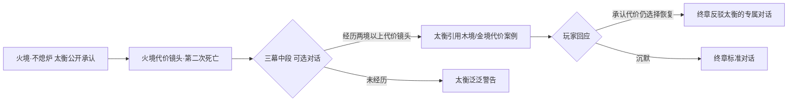

# 剧情代价镜头与太衡论据设计

## 1. 设计目标

- 让「恢复相克」产生可见、即时、可记忆的代价，玩家亲手造成的失去被看见，而不是只收获数值奖励。
- 让太衡的论据「一次性归还数百年积压的衰败会摧毁文明，有限的谎言和牺牲是必要的」至少被正面验证一次，终局抉择才有道德重量。
- 代价镜头不改变主线结果，只改变情感记忆、玩家选择与结局计分倾向。

## 2. 叙事原则

- 先给后夺：每个镜头先让玩家看到恢复的正面反馈（落叶、熔炉重燃、潮汐成形），再呈现代价，避免说教感。
- 代价落到具体面孔：一个名字、一个家庭、一场葬礼，不使用群体伤亡的抽象描述。
- 不占任务位：镜头为一次性过场或 NPC 对话，30–60 秒，不扩展任务表。
- 与支线联动：优先复用对应境的支线人物（苔七、泊生、余锋等），让熟悉的面孔承担代价。
- 可选择性：镜头提供「出席/回应/离开」等微选择，只在结局计分轴上记录倾向，不阻断主线。

## 3. 五境代价镜头

### 3.1 木境·第一个秋天

- 触发：木境主线「母树被修剪、森林迎来第一个秋天」之后。
- 内容：苔溪村一位靠寄生花维持意识的老人真正死去。第一次落叶中，村民聚在屋前，有人哭喊「你们把她的命剪掉了」。
- 关键对白：
  - 青檀：「我救不了她。但这一次，她死得是时候。」
- 微选择：出席葬礼（循环 +）/ 沉默离开（无倾向）。
- 呼应：与支线「苔七：借来的春天」共享「借来的生命该不该还」的主题。

### 3.2 金境·退锋

- 触发：天衡钟被毁、铸工停止制造无感军队之后。
- 内容：一名老铸工失去身份铃的秩序感，站在空炉前反复说「我记不得自己第几年做工了」。白刃把自己的名字念给他听，第一次没有讽刺。
- 关键对白：
  - 老铸工：「没有铃，我连自己是谁都不知道。」
  - 白刃：「那就从现在开始记。」
- 微选择：帮助老铸工登记新名（循环 +）/ 离开。
- 呼应：支线「余锋：会害怕的剑」——情感与职责分离后的第一课。

### 3.3 火境·第二次死亡（太衡论据的验证时刻）

- 触发：圣火被熄灭、离照家族残响消逝之后，紧接着不熄炉真相场景。
- 内容：一场「最后一句遗言」的葬礼——老人的余烬火灭，亲人在灰前无言。巡火队士气低落，有人低声说「太衡警告过：火灭了，城就冷了」。
- 关键对白：
  - 离照：「冷才能看见星星。他算不到这个。」
- 设计说明：这是全作唯一一次让太衡的预言被当场证实——火境确实陷入短期混乱。玩家若在这一刻仍选择支持恢复循环，终章面对太衡时才有资格反驳他；若动摇，也完全合理。
- 微选择：在葬礼上说出离照那句台词（无计分）/ 保持沉默（无计分）。

### 3.4 水境·退潮

- 触发：潮汐恢复、记忆开始退去之后。
- 内容：雨湾村一位老妇失去一段「借来的记忆」——她不记得自己为什么深爱这片水域，但记得爱本身。沈汐站在退色的水镜前，第一次用「我」说出自己的名字。
- 关键对白：
  - 沈汐：「遗忘不是被夺走，是还给时间。」
- 微选择：陪老妇重看一次海岸（共生 +）/ 离开。
- 呼应：支线「泊生：不存在的童年」与沈汐本人「混合记忆也是自我」的弧线。

### 3.5 土境·开裂

- 触发：祖城裂开、被封存者归来之后。
- 内容：一尊「自愿献身」的祖先塑像确实是自愿的——他的后代发现真相后，有人崩溃离开，有人选择留下守护。阿砾在公开场合第一次说出「我家祖辈的墓契，是假的」。
- 关键对白：
  - 阿砾：「墟门守的不是天下，是一桩旧账。现在账翻出来了。」
- 微选择：为自愿献身者立新碑（循环 +）/ 随阿砾离开。
- 呼应：序章 `FL-P01` 阿砾「那就先活着，名字以后再找」与终章「为无央记录新名字」之间的承诺线。

## 4. 太衡论据的验证结构

- 太衡的引用内容动态取决于玩家是否经历了对应境的代价镜头——经历过的玩家会听到他复述自己亲手做过的事，制造「他说的每一句我都无法否认」的压迫感。
- 所有分支只改变终章对话与结局判定，不改变主线走向。

## 5. 与结局计分器的关系

代价镜头本身不计分，但提供「循环」与「共生」轴的计分机会：

| 镜头 | 可选计分点 | 倾向 |
|---|---|---|
| 木境·第一个秋天 | 出席葬礼 | 循环 + |
| 金境·退锋 | 帮助登记新名 | 循环 + |
| 火境·第二次死亡 | 无计分（叙事验证位） | — |
| 水境·退潮 | 陪老妇重看海岸 | 共生 + |
| 土境·开裂 | 为自愿献身者立新碑 | 循环 + |

若某境支线未完成（如苔七、泊生未救），代价镜头可替换为普通 NPC 承担同样功能，保证主线流程不被支线阻断。

## 6. 实现建议

- 场景脚本：一次性 `Area3D` 触发 + 对话演出，复用序章「第一段残响」的褪色与镜头锁定模式。
- 演出时长：30–60 秒，不打断战斗节奏，不可重复触发。
- 状态记录：沿用《墟门序章任务规划》的持久化模式，新增 `cost_beat_<region>_seen` 与微选择枚举，第二境完成后再接入全局结局计分器。
- 优先级：随各境主线制作，火境·第二次死亡跟随不熄炉场景，是唯一与主场景强绑定的镜头。
