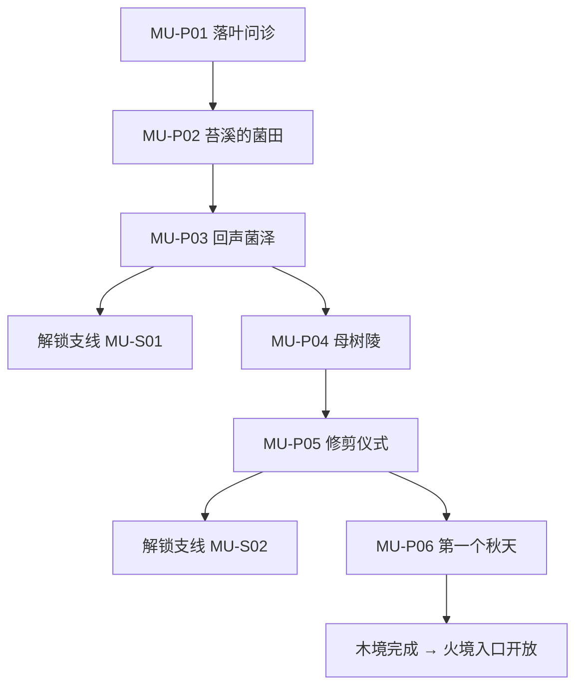

# 木境任务规划（第一幕·青蘅森海）

## 1. 范围与 ID 规范

- 主线时长：6–8 小时（含支线）。
- 地点：枝城、苔溪村、回声菌泽、母树陵、无暮庭。
- 章节任务 ID 前缀：木境主线 `MU-P01` 起，支线 `MU-S01` 起；金境为 `JI-`，火境 `HUO-`，水境 `SHUI-`，土境深层 `TU-`（序章 `FL-` 保留不动）。
- 教学目标：金克木破稳与处决（寄生花人、分蘖树人、缝合祭司、母树）、仪式型任务结构、证据板与残响图鉴首次完整使用。
- 剧情目标：揭示「没有凋零的相生会转化为腐败」，认识青檀，与金境埋下跨境交织线索。
- 交织说明：木境任务可先于或后于金境完成，两境互埋线索、顺序无关（见第 7 节）。

## 2. 主线总表

| ID | 任务名 | 预计时长 | 起点 | 完成条件 | 核心产出 |
|---|---|---|---|---:|---|
| MU-P01 | 落叶问诊 | 30 分钟 | 枝城 | 治好被寄生花缠绕的病人 | 认识青檀，了解「无秋」 |
| MU-P02 | 苔溪的菌田 | 40 分钟 | 苔溪村 | 查明菌田养分来源 | 母树根系供能之谜 |
| MU-P03 | 回声菌泽 | 50 分钟 | 回声菌泽 | 调查寄生花声音来源 | 金属刃具走私线索（金境交织） |
| MU-P04 | 母树陵 | 50 分钟 | 母树陵 | 发现母树真相与青檀妹妹意识 | 主线核心揭示 |
| MU-P05 | 修剪仪式 | 1–1.5 小时 | 无暮庭 | 完成分段修剪并击败母树 | 木之境裂片，森林迎秋 |
| MU-P06 | 第一个秋天 | 30 分钟 | 枝城 | 看完代价镜头与青檀告别 | 木架势「生机」开放 |

## 3. 主线流程

## 4. 主线任务明细

### MU-P01：落叶问诊

- **前置**：完成序章（`prologue_complete=true`），抵达木境入口。
- **触发器**：进入枝城。

**步骤**：

1. 枝城入口被盘查：木境没有「待验」身份的接收传统，无央的临时命契不被承认。
2. 一名被寄生花缠绕、仍能说话的病人被抬进医馆——青檀登场治疗。
3. 无央触碰病人时听到死者声音（本源感应教学，见 combat-narrative-fusion 第 7 节）。
4. 帮助青檀采集药草（引导玩家熟悉木境环境音与方向标志：枝城主干树）。

**关键对白**：

- 青檀：「她能说话，但说的不是自己的话。花在替她说。」
- 无央（模仿青檀的口吻）：「救活所有人……你是这么想的？」

**失败与重试**：采集区无死亡惩罚；被寄生花缠绕减速可用金架势破除。

**完成结果**：获得木境通行许可，认识青檀，解锁 `MU-P02`。

### MU-P02：苔溪的菌田

- **前置**：完成 `MU-P01`。
- **触发器**：与青檀一起进入苔溪村。

**步骤**：

1. 苔溪村菌田异常繁盛，菌农老苍看守菌田。
2. 调查发现菌田养分来自母树根系，而母树的「养分」来自活人记忆。
3. 老苍透露：数十年前森林停止落叶后，菌菇就开始「吃」记忆。
4. 青檀拒绝相信，但记录下根系走向——通向母树陵。

**关键对白**：

- 老苍：「我种了四十年菌子。头十年它吃土，后三十年，它吃人。」

**失败与重试**：无战斗，纯调查；对话选择只补充信息。

**完成结果**：解锁 `MU-P03` 与残响收集（苔溪村 2 段）。

### MU-P03：回声菌泽

- **前置**：完成 `MU-P02`。
- **触发器**：进入回声菌泽。

**步骤**：

1. 寄生花会模仿死者声音引诱旅人偏离道路（音效提示：模仿玩家操作音效，见 monster-bestiary 缝合祭司）。
2. 战斗教学：寄生花人、分蘖树人——金克木破稳与处决（执念闪现：花里是它自己的声音）。
3. 菌泽深处发现被丢弃的金属刃具——木境禁止金属，这是金境走私物（交织点 A）。
4. 刃具上刻着天衡钟的铸纹（交织点 B）。

**关键对白**：

- 青檀：「金属……木境不许用金属。这不是我们该有的东西。」

**失败与重试**：死亡从菌泽入口重试当前场次。

**完成结果**：解锁 `MU-S01` 与 `MU-P04`；证据板新增「金境走私刃具」。

### MU-P04：母树陵

- **前置**：完成 `MU-P03`。
- **触发器**：进入母树陵。

**步骤**：

1. 母树陵是历代居民归葬处，也是木境记忆网络核心。
2. 青檀发现寄生花的根系全部汇入母树——母树用活人记忆维持永生。
3. 记忆网络里出现青檀妹妹的声音：她的意识被母树保存至今，也是母树继续扩张的节点之一。
4. 青檀的选择场景：让妹妹的意识继续寄生，还是让她凋零（此处不立即选择，留给 `MU-P05` 仪式中决定）。

**关键对白**：

- 青檀：「我一直以为我在救她。原来母树用她当借口，吃了所有人。」

**失败与重试**：无战斗；记忆网络中的调查路线可重复。

**完成结果**：解锁 `MU-P05`；证据板新增「母树真相」。

### MU-P05：修剪仪式（无暮庭）

- **前置**：完成 `MU-P04`。
- **触发器**：进入无暮庭（树冠完全遮蔽、时间停在盛夏的首领区）。

**仪式结构**（quest-structure-differentiation 木境骨架）：

1. **第一段·断根**：用金架势斩断母树外缘根系（战斗：分蘖树人 ×2 + 寄生花人 ×2）。每断一根，场景闪回一名被吞记忆的死者。
2. **第二段·剔花**：缝合祭司精英战（执念：他献给母树的不是生命，是妹妹的）。战后寄生花串大面积枯萎。
3. **第三段·修剪**：青檀决定妹妹意识去留——凋零（循环 +1）或继续寄生（倾向记录，不计分）。此抉择不决定青檀个人任务线的成败，只影响任务线对白与情感路径（见第 6 节联动表）。
4. **第四段·母树**：母树首领战（招式见 monster-bestiary）。战斗中母树反复用花语召唤寄生花人恢复稳定，玩家需用金克木破稳后处决。

**关键对白**：

- 残响（母树终结时）：第一任祭司——「我种下它的时候，只想让死去的孩子留在身边。」

**失败与重试**：死亡从无暮庭入口重试，仪式进度保留（已断的根不重生）。

**完成结果**：森林迎来第一个秋天；获得「木之境裂片」；解锁 `MU-S02` 与 `MU-P06`。

### MU-P06：第一个秋天

- **前置**：击败母树。
- **触发器**：返回枝城。

**步骤**：

1. 落叶开始（木境场景状态机切换，见 quest-structure-differentiation 第 5 节）。
2. 代价镜头「木境·第一个秋天」（story-cost-beats 3.1）：苔溪村靠寄生花维持意识的老人真正死去，村民质问。出席葬礼（循环 +1）或沉默离开。
3. 青檀个人任务线起点：寻找妹妹散落的记忆种子（三步任务线见第 6 节）。
4. 无央获得木架势「生机」（combat-system-spec 3.4）。

**关键对白**：

- 青檀：「我救不了她。但这一次，她死得是时候。」

**完成结果**：木境完成，火境入口开放；若金境未完成，可自由前往金境。

## 5. 木境支线

### MU-S01：苔七·借来的春天（时序决定）

- **接取条件**：完成 `MU-P03`，尚未击败母树。
- **委托人**：菌农苔七。
- **目标**：调查他用寄生花保存的病逝伴侣声音。

**步骤**：

1. 苔七的花只重复伴侣最后一日的话（「花只是在重复最后一日」）。
2. 时序选择：立即处理（二选一：凋零 / 保留种子）；或搁置两个主线任务后再回来——花已自然凋零，苔七自己做了决定。
3. 选择影响：凋零（循环 +1）；保留不扩散的种子（共生 +1）；搁置（循环 +1，额外对白）。

**奖励**：生机叶 ×2。

### MU-S02：槐娘·长在屋中的人（行为判定）

- **接取条件**：完成 `MU-P05`。
- **委托人**：槐娘（异类，与住宅巨树融合）。
- **目标**：五衡院要求焚毁槐娘，玩家需证明她保有人格。

**步骤**：

1. 槐娘无法移动，但照顾整条街的孩子。
2. 五衡院衡吏纵火——战斗；**行为判定**：战斗中误伤孩子（NPC 会受伤）则槐娘态度恶化；用精准破稳（金克木断火路）则她信任玩家。
3. 疏导根系、证明人格后，槐娘保留（共生 +1）；终章她保护枝城居民。

**奖励**：生机叶 ×2；终章状态记录。

## 6. 青檀个人任务线（羁绊轴）

角色任务定义：青檀在 `MU-P05` 后发现妹妹的意识并未完全消散——它散成了寄生花种子，散布在森林各处。任务线三步，最终抉择决定羁绊轴是否达成（characters-and-quests 第 3 节「找回三块…决定让其凋零或继续寄生」的木境对应物）。

### 步骤 1：记忆的种子

- 触发：`MU-P06` 完成后，森林出现 3 处可感应到的寄生花种子（本源感应高亮，与残响图鉴联动：种子即妹妹死前最后一段记忆的碎片）。
- 内容：与青檀一起收集 3 枚种子；每枚种子播放一段妹妹的记忆（语调与「无秋」年代的枝城日常有关）。
- 产出：青檀把种子种进药匣，声称「只要种子还在，她就没有完全死」。

### 步骤 2：种子的回响

- 触发：收集完 3 枚种子后，调查枝城旧居（妹妹生前的房间）。
- 内容：发现种子回放的记忆全部止于同一天——妹妹死前最后一日。种子不是「妹妹」，是母树保存的最后一段复制。
- 关键对白：
  - 青檀：「我找了这么多年……原来我一直在找的是一段录下来的话。」
- 产出：青檀开始动摇；任务线进入最终抉择。

### 步骤 3：凋零或种植

- 内容：最终抉择——
  - **凋零**：让种子在第一个秋天的落叶中腐化。青檀接受死亡是治疗的一部分，完成转变（羁绊 ✓，循环 +1）。
  - **继续种植**：青檀把种子种回苔溪村。任务线关闭（羁绊 ✗），青檀留在木境继续照料种子，终章缺席或服从五衡院立场。
- 关键对白（凋零路线）：
  - 青檀：「她早就死了。是我让母树替她活着。现在，让她死得是时候。」

### 与 MU-P05 抉择的联动表

| MU-P05 抉择 | 步骤 3 选择凋零 | 步骤 3 选择种植 |
|---|---|---|
| 凋零（主线） | 青檀最早就接受，任务线对白最短、最平静 | 青檀在种植时多一句自嘲「我在重复自己骂过的事」 |
| 继续寄生（主线） | 青檀全程更挣扎，凋零时哭着完成 | 青檀沉默，拒绝再谈种子 |

四条路径均不影响任务线可接与可完成，只改变对白与情感强度；羁绊判定只看步骤 3。

## 7. 计分点汇总（对接 ending-scorecard）

| 来源 | 循环 | 共生 | 羁绊 |
|---|---:|---:|---:|
| MU-P05 青檀抉择：凋零 | +1 | — | — |
| MU-P05 青檀抉择：继续寄生 | — | 倾向记录，不计分 | — |
| MU-P06 出席葬礼 | +1 | — | — |
| MU-S01 凋零 / 保留种子 / 搁置 | +1 | +1（保留） | — |
| MU-S02 槐娘保留 | — | +1 | — |
| 青檀个人任务：步骤 3 凋零 | — | — | ✓（+循环 +1） |
| 青檀个人任务：步骤 3 种植 | — | — | ✗ 任务关闭 |

## 8. 与金境的交织点

| 交织点 | 位置 | 先木后金的体验 | 先金后木的体验 |
|---|---|---|---|
| A 走私刃具 | MU-P03 | 发现金境走私金属——「金境在偷偷往木境运刀」 | 金境已见过走私线，认出这是同一条线路 |
| B 天衡钟铸纹 | MU-P03 | 刃具刻着天衡钟铸纹，为金境天衡塔调查埋疑 | 金境已知天衡钟铸造融了母树树髓，认出铸纹来源 |
| C 永生材料 | MU-P04 | 母树陵的记忆流向「北方某个炉子」（不熄炉伏笔） | 金境磁砂矿谷的运输记录指向母树，回来时线索闭环 |
| D 密使 | MU-P02 | 枝城出现金境口音的「商人」，行为可疑 | 金境已见过天衡官密使，认出此人 |

## 9. 验收标准

- [ ] 主线 6 任务在 6–8 小时内可完成，不做支线可连续通过。
- [ ] 金克木破稳至少出现 3 次（战斗 ×2、仪式 ×1），每次有低压力复现。
- [ ] 仪式结构（断根/剔花/修剪/母树）四段可读，死亡重试保留仪式进度。
- [ ] 交织点 A–D 在两种通关顺序下均成立，不产生硬依赖。
- [ ] 青檀个人任务起点（记忆种子）在 `MU-P06` 后自然衔接。
