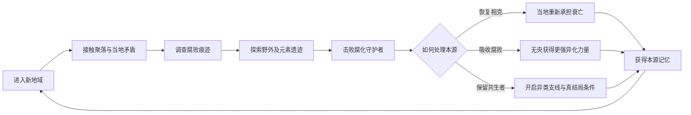
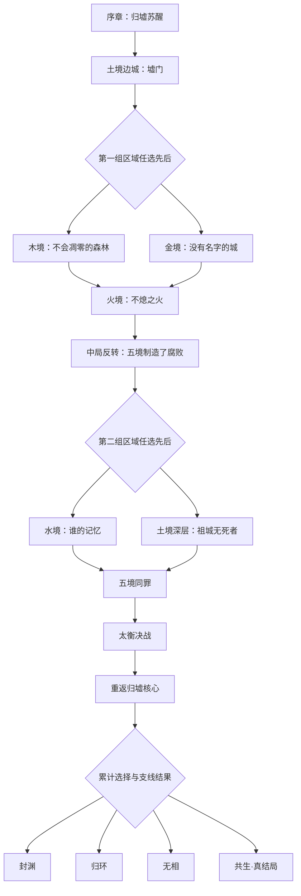
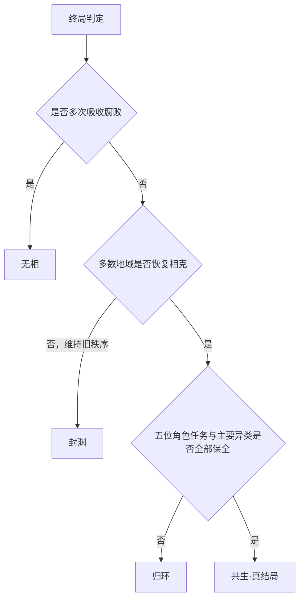

# 《Five Land》世界观与剧情规划

## 1. 游戏基本规划

- 类型：单机 HD-2D 即时动作 RPG。
- 目标时长：主线约 20 小时，主线加主要支线约 25–30 小时。
- 世界结构：木、火、土、金、水五境围绕中央归墟，采用半开放章节推进。
- 玩家角色：从归墟苏醒的女孩“无央”。
- 核心体验：探索五境、追查腐败来源、驾驭相生相克、判断异类是否值得被保留。
- 叙事基调：东方黑暗奇幻为底色，以悬疑推动探索，终局上升为五境共同命运。

## 2. 核心玩法循环

无央可以在战斗中切换五行架势。相生用于连招与强化，相克用于打断、破防和破解环境机关：

- 木生火、火生土、土生金、金生水、水生木：正确衔接时强化下一种架势。
- 木克土、土克水、水克火、火克金、金克木：针对敌人或机关时快速削减“五行稳定”。
- 腐败之力提供高风险爆发，但会改变部分对话、场景和结局条件。

五行探索能力主要用于捷径、隐藏遗迹和支线，不锁死半开放主线顺序。

## 3. 世界规则

世界由“相生”与“相克”共同维持。相生让事物诞生、发展和传承；相克让过盛之物衰败、归还并重新进入循环。二者不是善恶关系，而是一套完整的代谢。

五境统治者为了延续本境繁荣，逐渐只取相生之利，拒绝相克带来的死亡、损耗与变化。他们建立五衡院，将疾病、败亡、失控元素、死者记忆和政治异见投入中央归墟。

归墟原本不是地狱，而是世界分解旧物、归还本源的器官。持续倾倒使它失去处理能力，无法归类的残余凝结为“腐败”。腐败接触生命后，会把其最不愿失去的部分无限放大：森林拒绝凋零，火焰拒绝熄灭，城邦拒绝情感，记忆拒绝消散。

被腐败改变却仍保有人格的生命被称为“异类”。五衡院将异类统一视作灾害，因为他们的存在证明腐败并非来自归墟，而是来自五境自身。

## 4. 主角真相

无央没有被遗忘的童年。她是归墟为了恢复循环，将五境遗弃的五枚本源碎片缝合成的人形容器。

她能够承受五行，却不属于任何一境。每当她净化一枚碎片，就会取回一段属于无数死者的共同记忆，并在身体上留下对应颜色的裂纹。她越接近完整，越难分辨自己的意志与世界要求她完成的使命。

深渊中的“引渊人”是上一代修复容器残留的人格。他引导无央收集碎片，也隐瞒了修复旧循环必须让容器消散的事实。

## 5. 主线任务与章节大纲

### 序章：深渊来客（约 2 小时）

无央在归墟浅层苏醒，循着引渊人的灯火逃出裂口，抵达土境边城“墟门”。边城正在将一批染病居民送入归墟。送葬人阿砾发现无央没有土境户籍和命契，却能平息腐败。

首领战“负碑兽”后，无央看见第一段本源记忆：五衡院并非抵御归墟，而是在向其中倾倒废弃物。太衡宣布无央为危险异类，并派出衡吏追捕。

### 第一幕：被禁止的衰亡（约 6–8 小时）

玩家可先前往木境或金境，两境均完成后进入火境。

#### 木境主线：不会凋零的森林

青蘅森海已经数十年没有真正的死亡。树木不断分蘖，死者的声音从寄生花中传出。医师青檀发现母树用活人的记忆维持永生。无央必须重新引入金克木的“修剪”，让森林第一次迎来秋天。

#### 金境主线：没有名字的城

白铸城邦以职业替代姓名，将“不必要的情感”铸成金属投入归墟。逃亡铸工白刃请求无央毁掉记录所有人职责的天衡钟。真相显示五衡院正用这些情感制造没有恐惧的军队。

### 第二幕：不熄之火（约 4 小时）

火境赤烬原举行百年不熄的国葬，所有死者都被保存在余烬中。巡火队长离照起初协助太衡抓捕无央，因为他的家族也存在于圣火之内。

无央进入“不熄炉”后发现，五衡院用木境的生命、金境的情感和火境的记忆维持一套抽取本源的装置。太衡公开承认真相：若立即恢复完整循环，五境将一次性承受数百年积压的衰败。中局首领战后，不熄炉破裂，腐败第一次同时侵入五境。

### 第三幕：谁拥有过去（约 6–8 小时）

玩家可先前往水境或返回土境深层，两境均完成后进入终章。

#### 水境主线：谁的记忆

玄溟泽国用水镜保存记忆，腐败使记忆在居民之间流动。潜游者沈汐拥有数百人的人生，却找不到自己的童年。无央潜入沉镜宫，发现五衡院曾抹去上一代容器的失败记录。

#### 土境主线：祖城无死者

土境宣称祖先永远守护后代，实际将不服从者封进地下塑像。阿砾发现自己的家族世代负责修改墓契，他记忆中的父母也是被重写的受害者。无央必须让木克土重新生效，使祖城开裂并释放被封存者。

### 终章：五境同罪（约 3–4 小时）

五条古道恢复，幸存者、五衡院军队和异类同时赶往中央归墟。太衡试图夺取无央体内的碎片，重建由五衡院控制的封印。五位关键角色是否完成个人支线，将决定他们在汇战中的立场与命运。

击败太衡后，无央进入归墟核心。引渊人揭示容器的宿命，并要求她归还全部人格。玩家此前对本源、异类和同伴的处理共同决定结局。

## 6. 主线流程图

## 7. 多结局规则

结局由整段旅程累计形成，不由终局的单次选择直接决定。系统记录三个方向：

- 循环：是否让五境重新接受相克、死亡和自然损耗。
- 共生：是否帮助仍保有人格的异类，而非将其一律净化。
- 羁绊：是否完成阿砾、青檀、离照、白刃和沈汐的个人任务。

### 《封渊》

玩家多次维持旧秩序，或选择与太衡合作。归墟被重新封闭，五境暂时恢复繁荣，片尾显示腐败在新裂缝中再次出现。

### 《归环》

玩家在多数地域恢复相克，但未满足共生与羁绊条件。无央归还五枚碎片并消散，旧循环恢复，五境重新经历正常的生老病死。

### 《无相》

玩家多次将腐败吸入自身。无央吞下归墟，成为五行之外的稳定意志。世界不再腐败，也不再衰老、繁殖或改变。

### 《共生》·真结局

玩家在五境恢复相克、完成五位关键角色任务，并保护主要异类角色。五境主动分担积压的衰败，腐败被承认为循环中的正常阶段。无央保留人格，成为往来五境与归墟之间的第一位“渡衡者”。

