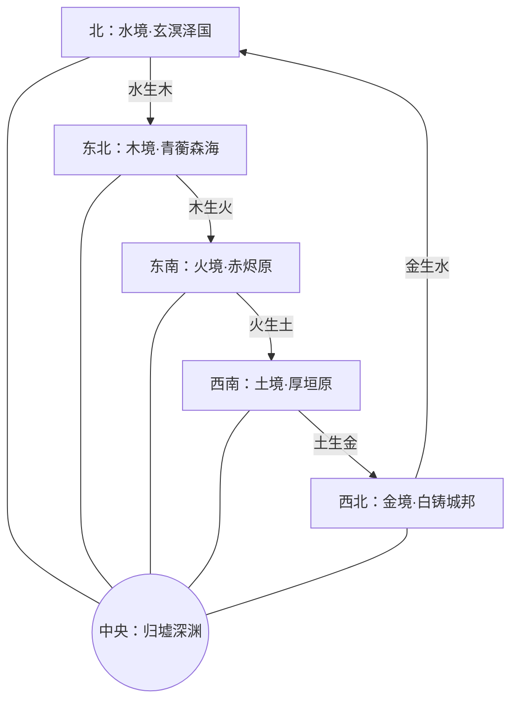
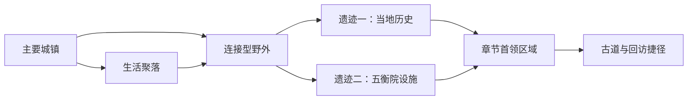

# 《Five Land》地图、地域文化与场景风格

## 1. 世界地图结构

五境按相生顺序围绕中央归墟。北方为水境，东北为木境，东南为火境，西南为土境，西北为金境。五行古道构成外环，并各有一条被封闭的道路通往归墟。

## 2. 区域规模与探索节奏

每一境采用同一套可控规模：一座主要城镇、一处生活聚落、一片连接型野外、两处元素遗迹和一处章节首领区域。玩家能在主线后返回旧区域，使用新能力开启捷径、异类居所和隐藏记忆。

## 3. 木境·青蘅森海

### 地图节点

- 枝城：搭建在多棵巨树之间的主城，住宅随枝干生长而迁移。
- 苔溪村：以菌田和药草为生的林下聚落。
- 回声菌泽：寄生花会模仿死者声音，引诱旅人偏离道路。
- 母树陵：历代居民归葬之处，也是木境记忆网络的核心。
- 无暮庭：被树冠完全遮蔽的首领区域，时间仿佛停在盛夏。

### 生活习俗

- 新生儿获得一枚种子和一个乳名，成年后根据种子长成的形态取得正式姓名。
- 房屋不归个人所有，居民随树木生长定期换居。
- 葬礼称为“归根”，死者本应被母树分解并滋养新生。
- 最大禁忌是主动砍伐健康树木，因此金属刃具被严格管制。

### 腐败与场景变化

金克木被排除后，森林失去修剪和凋零。前期环境繁茂美丽，深入后可见树根穿过屋舍与人体。恢复循环后，木境首次出现落叶、枯枝和开阔天空。

## 4. 火境·赤烬原

### 地图节点

- 烬市：围绕巨大余火盆形成的商旅城市。
- 迁火营：巡火商队的移动聚落，每晚必须传递同一束祖火。
- 灰誓道：遍布纪念碑和焚烧坑的火山道路。
- 灰誓宫：以余烬保存历代统治者记忆的宫殿。
- 不熄炉：抽取五境本源的中局核心设施。

### 生活习俗

- 家庭用余烬保存先人最后一句话，火灭被视作第二次死亡。
- 婚约以交换火种完成，离别时则归还冷灰。
- 商队依靠火山周期迁徙，擅长铸陶、玻璃和香料贸易。
- 最大禁忌是用水直接扑灭祭火。

### 腐败与场景变化

水克火被拒绝后，火焰会不断重演被焚毁之物的最后时刻。恢复循环后，永久燃烧的荒原出现夜色，居民第一次看见真正的星空。

## 5. 土境·厚垣原

### 地图节点

- 墟门：紧邻归墟裂口的边城，也是序章据点。
- 背山田：依山修建的梯田聚落，以墓契决定土地继承。
- 碑兽峡：驮负无名石碑的异兽迁徙路线。
- 埋名祖城：封存被历史删除者的地下城市。
- 镇岳台：土境统治者和五衡院共同维护的封印设施。

### 生活习俗

- 每人出生时登记“命契”，记录家族、土地与预定墓位。
- 重要决定要在祖先塑像前宣誓，违约者会从族谱中除名。
- 送葬人负责跨越阶层和村落，因此掌握大量被隐藏的历史。
- 最大禁忌是无墓而死；没有墓位的人被认为无法成为祖先。

### 腐败与场景变化

木克土被排除后，土地拒绝松动，城镇和居民逐渐石化。恢复循环后，祖城裂开，植物穿过石缝，长期停滞的河道重新改道。

## 6. 金境·白铸城邦

### 地图节点

- 白垣城：沿矿山断壁向上生长的垂直主城。
- 铃镇：制造身份铃和精密零件的工匠聚落。
- 磁砂矿谷：武器会被地形牵引的危险野外。
- 无名铸廊：将情感铸成器具的五衡院工坊。
- 天衡塔：记录全境职业与职责的首领区域。

### 生活习俗

- 成年人以职业代号替代姓名，身份铃记录其职责和工作年限。
- 损坏的工具要举行“退锋礼”，感谢其完成职责。
- 城邦重视精确、契约和可验证的成果，情绪表达被视为影响判断。
- 最大禁忌是私自改造身份铃或从事登记外的工作。

### 腐败与场景变化

火克金被排除后，金属和制度都无法被重铸。居民逐渐失去情感，成为只执行职责的“活器”。恢复循环后，熔炉重新点燃，冰冷城市出现手工制品与不规则色彩。

## 7. 水境·玄溟泽国

### 地图节点

- 泊灯港：以船屋、桥市和高脚楼组成的主城。
- 雨湾村：终年降雨的渔猎聚落。
- 失名水道：会交换同行者记忆的迷宫河网。
- 沉镜宫：保存公共记忆的水下遗迹。
- 归潮眼：控制全境潮位并连接归墟的首领区域。

### 生活习俗

- 成年礼要把一段童年记忆存入公共水镜，象征个人属于共同体。
- 舟市随潮汐迁移，没有永久摊位和固定街道。
- 争端由“观忆人”读取双方自愿交出的记忆裁决。
- 最大禁忌是未经同意触碰他人的水镜。

### 腐败与场景变化

土克水被排除后，水失去边界，记忆在人群中自由渗透。恢复循环后，潮汐重新形成岸线，部分记忆永久退去，居民必须接受遗忘。

## 8. 中央归墟

### 地图节点

- 五行古道：五境共同修建、后来主动封闭的环形道路。
- 无色层：五行力量彼此抵消，玩家只能依赖基础动作战斗。
- 残响城：由被五境删除的建筑与记忆拼合而成。
- 归环核：世界分解旧物并归还本源的核心。

归墟从上至下逐渐失去五境色彩。终章中，玩家此前保留的异类和完成的角色任务会让色彩重新进入深渊，直接表现结局条件。

## 9. HD-2D 视觉规范

### 共通原则

- 人物与怪物使用细节 Q 版像素方向帧；轮廓、服装色块和武器动作必须在实际游戏尺寸下清晰可读。
- 地形、建筑、植被和大型机关使用风格化低多边形 3D 模型，以简化几何、手绘材质和克制的 PBR 反光保持统一，不追求写实扫描质感。
- 采用固定倾角的正交或低视野角镜头。探索和战斗期间不允许玩家自由旋转镜头；演出只允许平滑推拉与小幅偏移。
- 2D 角色存在于真实 3D 坐标中，必须接受场景冷暖调色、接触阴影、薄雾和前景遮挡；使用 Alpha Scissor 避免透明排序错误。
- 角色纹理使用 Nearest 过滤并保持原生像素簇，禁止平滑缩小或二次像素化高清立绘。
- 用前景遮挡、中景探索和远景地标建立纵深，每个区域始终保留一个可辨认的方向标志。
- 元素不仅依靠颜色区分，同时使用固定纹样、粒子运动和音效节奏，保证色觉差异玩家也能识别。
- 设置减少闪光、屏幕震动和高密度粒子的选项。

### 地图展示与相机合同

地图镜头以“先读路线，再读装饰”为原则。相机不是始终把玩家锁在画面正中心，而要给前进方向、敌人预警和区域地标留出稳定空间。

#### 基准构图

- 使用固定倾角正交相机；序章当前机位偏移为 `(0, 12, 10)`，不允许探索时自由旋转。
- 1280×720 下，探索正交尺寸以 `7.0` 为目标，普通战斗以 `6.2` 为目标；首领战可根据玩家与首领的包围范围拉远到 `7.5–8.0`。
- 探索时角色高度占画面高度约 `10–15%`，普通战斗不超过 `20%`。不得为了展示角色细节牺牲前方路线信息。
- 玩家默认位于画面水平中央、垂直约 `58%` 的位置，即略低于中心；屏幕上方保留主要前进空间。
- 移动时沿输入方向提供 `0.6–1.2m` 的平滑前瞻，停止后缓慢回正。区域边界钳制不能让镜头瞬间跳动。
- 探索、战斗、首领战之间的尺寸变化控制在 `10–20%`，使用缓动过渡，禁止突兀抽拉。

#### 地图层次

单屏应同时建立三个可读层次：

1. **中景行动层**：玩家、敌人、机关和可行走边界。它必须拥有最高对比度，不允许被持续粒子、纯黑剪影或强反光覆盖。
2. **远景导航层**：门楼、巨碑、桥梁、祭坛或区域天际线。每个地图分段至少提供一个可辨认地标，用于说明前进方向。
3. **前景框景层**：近处岩壁、树干、屋檐和栏杆。它只负责制造纵深，不承担导航信息。

路径宽度、岔口和高低差要在角色到达前可见。狭窄走廊至少展示前方一个遭遇距离；开放区域应能同时看见主要目标和一条次要探索线索。

#### 前景遮挡

- 前景不可见面积通常不超过画面的 `20–25%`；纯黑区域不得长期侵入中央行动区。
- 摄像机与玩家之间出现岩壁、树冠或屋檐时，将遮挡物平滑降至 `25–35%` 不透明度，并保留外轮廓或边缘描线。
- 战斗状态进一步降低遮挡；首领、危险区域和攻击预警不得被前景覆盖。
- 底部前景可以形成框景，但高度原则上不超过画面高度的 `12%`。两侧前景不能同时形成狭窄黑框。
- 暗角用于聚焦而非遮挡地图。基准强度控制在 `0.14–0.18`，不得与前景剪影叠加后压黑 HUD 或路径边缘。

#### 参考作品

参考只用于研究镜头、地图层次和遮挡策略，不复制关卡布局、资产或具体构图。

| 作品 | 主要参考点 | Five Land 取用方式 |
|---|---|---|
| [No Rest for the Wicked](https://store.steampowered.com/app/1371980/No_Rest_for_the_Wicked/) | 中远距地图纵深、地标与多层台阶 | 学习地图密度和远景导航；不采用其偏小的角色比例 |
| [TUNIC](https://store.steampowered.com/app/553420/TUNIC/) | 玩家偏下、前方留白、前景透明化 | 作为探索镜头与遮挡处理的主要参考 |
| [Death's Door](https://store.steampowered.com/app/894020/Deaths_Door/) | 清楚的房间边界、路径留白、战斗可读性 | 作为遭遇区域和岔路构图参考 |
| [Hades](https://store.steampowered.com/app/1145360/Hades/) | 封闭战场完整入镜、预警无遮挡 | 只参考战斗房间，不作为长路径探索距离基准 |
| [Children of Morta](https://store.steampowered.com/app/330020/Children_of_Morta/) | 像素角色与暗色场景的层次分离 | 参考像素轮廓、光区和前景剪影的平衡 |

综合方向为：**No Rest for the Wicked 的地图层次、TUNIC 的探索构图与前景淡化、Death's Door 的路径可读性。**

#### 1280×720 验收

- 玩家静止时，截图中必须能判断主要前进方向，并至少看见一个前方地标或遭遇线索。
- 玩家、敌人、可走地面和危险预警不得落入同一深色阶。
- 去掉 HUD 后，中央 `60%` 画面仍应以行动层为主，前景不得把可玩区域切成多个孤立窗口。
- 探索、普通战斗和首领战各截一张图，检查角色屏占比、前方留白、遮挡面积和路径连续性。

### 地域效果

| 地域 | 主材质与对比色 | 光照与天气 | 标志性效果 |
|---|---|---|---|
| 木境 | 深绿植被、灰白树皮、紫红菌菇 | 树冠光斑、薄雾、阵雨 | 前景枝叶、孢子、藤桥摆动、季节转换 |
| 火境 | 黑色玄武岩、朱红熔岩、青色祭火 | 高反差火光、灰云、热浪 | 灰烬、空气折射、熔岩反光、余烬人影 |
| 土境 | 黄褐岩层、青绿矿脉、白色墓碑 | 低角度日光、沙尘、地下冷光 | 地裂、落石、远景城墙升降、石化蔓延 |
| 金境 | 银灰金属、锈红管道、暖金灯火 | 冷雾、窄束工业光 | 火花、齿轮投影、磁力颗粒、垂直升降 |
| 水境 | 深青水面、琥珀舟灯、白色雨幕 | 阴雨、月光、动态反射 | 水位变化、倒影错位、水下折射、记忆残像 |
| 归墟 | 近黑岩体、褪色五行脉络 | 自下而上的体积光 | 倒悬遗迹、重力错觉、五色逐层恢复 |

### 战斗特效约束

- 木：生长轨迹呈分叉线条，攻击结束后快速收束，避免持续遮挡角色。
- 火：强调瞬间亮度和余烬拖尾，不以全屏闪白表现冲击。
- 土：使用方块碎片、尘环和短促镜头震动表现重量。
- 金：使用直线、锐角和短暂反光表现切割与弹反。
- 水：使用弧线、波纹和残影表现位移及控制。
- 腐败：不单独使用黑雾，而以错误生长、重复动作、材质错位和声音倒放表现“不该持续的事物”。
