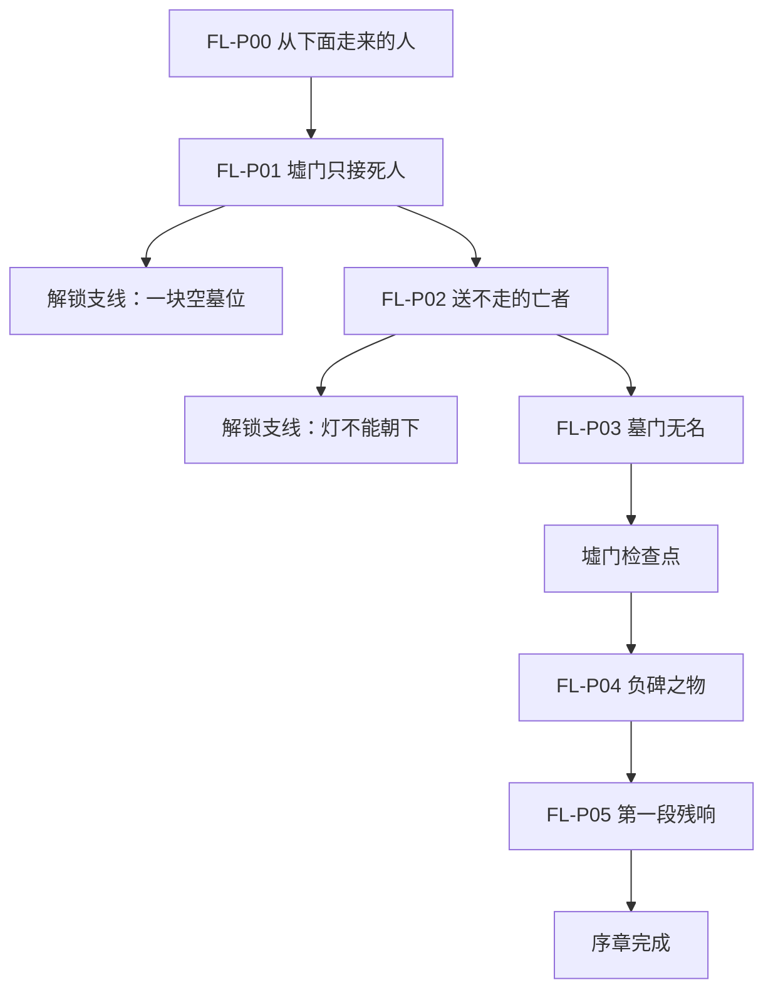
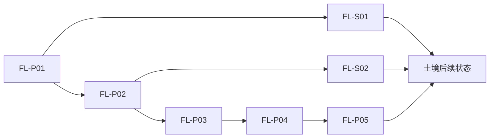

# 《Five Land》墟门序章任务规划

## 1. 范围

- 主线时长：15–20 分钟。
- 全支线时长：额外 8–12 分钟。
- 地点：归墟出口、墟门、送葬道、封印庭院、负碑兽巢穴。
- 教学目标：移动、闪避、普通攻击、土/水架势切换、相克破稳、互动和任务追踪。
- 剧情目标：让玩家认识无央与阿砾，建立“归墟被视为污染源”的表象，并首次展示五衡院向归墟倾倒废弃物的证据。

## 2. 主线总表

| ID | 任务名 | 预计时长 | 起点 | 完成条件 | 核心产出 |
|---|---|---:|---|---|---|
| FL-P00 | 从下面走来的人 | 2 分钟 | 归墟出口 | 抵达墟门外桥 | 移动、闪避教学 |
| FL-P01 | 墟门只接死人 | 3 分钟 | 墟门 | 与阿砾完成首次对话 | 获得临时身份与调查目标 |
| FL-P02 | 送不走的亡者 | 4–5 分钟 | 送葬道 | 击败四名腐化者 | 攻击、架势与相克教学 |
| FL-P03 | 墓门无名 | 3 分钟 | 封印庭院 | 启动土行封印并打开墓门 | 环境互动与世界观证据 |
| FL-P04 | 负碑之物 | 4–6 分钟 | 负碑兽巢穴 | 击败负碑兽 | 首领战与第一枚本源裂片 |
| FL-P05 | 第一段残响 | 2 分钟 | 归墟裂井 | 看完本源记忆并返回阿砾处 | 揭示五衡院倾倒行为 |

## 3. 主线流程图



## 4. 主线任务明细

### FL-P00：从下面走来的人

**前置条件**：新游戏。

**触发器**：场景载入后自动开始。

**步骤**：

1. 无央在归墟出口醒来，画面只显示移动目标。
2. 穿过倒悬石碑区域，学习移动与镜头方向。
3. 第一次地面崩裂时提示闪避。
4. 调查一盏朝向深渊的石灯，听见引渊人的第一句残响。
5. 沿石桥抵达墟门外，看到送葬队正在把封闭棺木推向归墟。

**关键对白**：

- 引渊人：“往上走。活人总把不要的东西放在上面。”
- 守门人：“退回去。墟门只接死人，不放死人回来。”

**失败与重试**：跌落或被崩裂击中只返回最近石台，不扣除资源。

**完成结果**：解锁互动键，开始 `FL-P01`。

### FL-P01：墟门只接死人

**前置条件**：完成 `FL-P00`。

**触发器**：进入 `Trigger_XumenGate`。

**步骤**：

1. 守门人拒绝无央入城，并因她没有命契准备呼叫衡吏。
2. 阿砾以“待验尸体”的名义暂时接收无央。
3. 跟随阿砾进入停尸棚，检查一具长出黑色石脉的尸体。
4. 无央触碰尸体后听到来自送葬道的腐败回声。
5. 阿砾要求无央协助查明送葬队失踪原因，以换取临时命契。

**关键对白**：

- 阿砾：“墟门只接死人。你从下面走上来，算哪一种？”
- 无央：“我不知道。”
- 阿砾：“那就先活着，名字以后再找。”

**玩家选择**：可询问“命契”“归墟”或“你为什么帮我”。选择只补充信息，不改变任务结果。

**完成结果**：获得临时身份“阿砾所属·待验”，解锁 HUD 任务目标和支线 `FL-S01`。

### FL-P02：送不走的亡者

**前置条件**：完成 `FL-P01`。

**触发器**：与阿砾一起进入 `Encounter_BurialRoad`。

**步骤**：

1. 调查翻倒的送葬车，获得普通攻击提示。
2. 击败第一名土行腐化者，学习攻击、受伤和锁定方向。
3. 第二名腐化者释放火性石脉，解锁水架势。
4. 使用水克火打破其“五行稳定”，触发处决窗口。
5. 同时面对两名行动较慢的腐化者，练习闪避和架势切换。
6. 调查棺木，发现里面没有尸体，只有刻着编号的五衡院废弃物。

**战斗配置**：

- 第一场：1 名土行腐化者。
- 第二场：1 名火蚀腐化者。
- 第三场：2 名土行腐化者，不新增招式。

**失败与重试**：死亡后从送葬道入口重试当前场次；已看过的教学提示不重复强制暂停。

**完成结果**：土、水架势永久开放，解锁支线 `FL-S02` 和通往封印庭院的道路。

### FL-P03：墓门无名

**前置条件**：完成 `FL-P02`。

**触发器**：调查 `Gate_GraveSeal`。

**步骤**：

1. 阿砾发现墓门需要有效命契，但门上的姓名全部被凿去。
2. 玩家在庭院找到三个封印桩，按石脉亮起的顺序使用土架势稳定它们。
3. 每稳定一个封印桩，场景会闪回一名无名者被投入归墟的片段。
4. 三个封印完成后，墓门拒绝阿砾，却回应没有命契的无央。
5. 无央承受土行裂片，墓门打开，身体出现第一道黄绿色裂纹。

**失败与重试**：顺序错误只重置未完成的封印桩，不伤害玩家。

**完成结果**：开启墟门检查点，解锁土架势的防御效果，开始 `FL-P04`。

### FL-P04：负碑之物

**前置条件**：完成 `FL-P03`。

**触发器**：进入 `Arena_BurdenBeast`。

**首领阶段**：

1. **负碑冲撞**：负碑兽追踪后直线冲撞，玩家通过闪避寻找攻击窗口。
2. **火链砸地**：背部锁链发红后砸向扇形区域，水架势可快速打破稳定。
3. **碑山压顶**：生命低于一半后跃起落地，土架势可防住震波但不能防住中心伤害。

**战斗目标**：首次成功用时 90–150 秒；每个攻击必须有动作、地面形状和声音三重提示。

**失败与重试**：死亡后从墓门检查点重试；跳过入场演出；首领生命与场地恢复。

**完成结果**：获得“土之本源裂片”，打开归墟裂井，开始 `FL-P05`。

### FL-P05：第一段残响

**前置条件**：击败负碑兽。

**触发器**：调查 `Trigger_FirstMemory`。

**步骤**：

1. 场景褪色，仅保留五衡院封印上的颜色。
2. 玩家以不可战斗状态走过一段可控记忆。
3. 记忆显示衡吏把疾病、失败实验和被删除姓名投入归墟。
4. 引渊人要求无央继续寻找其余碎片，却回避“上一位容器”的问题。
5. 返回阿砾处。阿砾决定暂时隐瞒无央身份，并带她离开墟门。

**关键对白**：

- 残响：“他们不是在封住深渊。他们在往里面倒东西。”
- 阿砾：“要是这是真的，墟门守的就不是天下，是一桩旧账。”

**完成结果**：显示序章标题，保存 `prologue_complete=true`，开放后续木境/金境路线入口。

## 5. 序章支线

### FL-S01：一块空墓位

**接取条件**：完成 `FL-P01`，尚未进入负碑兽巢穴。

**委托人**：守墓人砚婆。

**目标**：为一具没有命契的尸体寻找合法墓位。

**步骤**：

1. 调查空墓、公共墓册和被划掉的旧墓契。
2. 得知死者是被宗族除名的送葬人。
3. 选择将其写回原宗族，或建立“无名者共同墓位”。
4. 与砚婆完成下葬。

**选择影响**：

- 写回宗族：获得更多墟门居民支持，但延续血缘决定归属的旧规。
- 共同墓位：记录一个“循环”倾向，并在土境深层支线中解锁额外对白。

**奖励**：生命上限提高 1 点；不提供独占战斗能力。

**预计时长**：4–6 分钟。

### FL-S02：灯不能朝下

**接取条件**：完成 `FL-P02`。

**委托人**：守灯童小烛。

**目标**：找回被送葬队遗落在归墟出口的石灯。

**步骤**：

1. 从送葬道返回归墟出口，清除一处可绕过的小型腐败结晶。
2. 找到石灯，发现灯芯由异类的记忆维持。
3. 选择熄灭灯芯，或允许记忆继续存在但改变灯的朝向。
4. 把石灯交还小烛。

**选择影响**：

- 熄灭：记录“净化”倾向，获得一枚普通恢复物。
- 保留：记录“共生”倾向，记忆会在终章成为一条可辨认的声音。

**奖励**：解锁墟门检查点的快速返回功能。

**预计时长**：4–6 分钟。

## 6. 任务依赖与状态



需要持久化的最小状态：

```text
prologue_step
prologue_complete
side_blank_grave_complete
side_blank_grave_choice
side_downward_lantern_complete
side_downward_lantern_choice
```

序章阶段不建立通用结局计分器。选择只保存明确枚举值，等第二个地域完成后再接入全局结局状态。

## 7. 制作验收

- [ ] 主线可在不做支线的情况下连续完成。
- [ ] 两条支线在进入首领战前都可完成，且不会阻断主线。
- [ ] 任务目标始终只有一个主目标，支线单独显示。
- [ ] 死亡重试不会重复发放奖励或重复生成敌人。
- [ ] 已观看的教学提示不会再次强制暂停。
- [ ] 土、水架势各至少有一次必须理解其作用的场景。
- [ ] 负碑兽攻击不依赖颜色即可辨认。
- [ ] 第一段残响明确提供证据，但不提前揭示无央的完整身份。
- [ ] 序章结束后，玩家能说清楚“归墟可能不是污染源”这一核心疑问。
