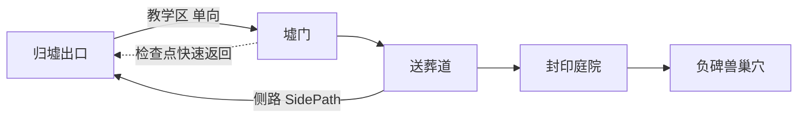

# 序章回退路径与支线流程设计

## 1. 问题陈述

序章主线空间是单向推进的：归墟出口 → 墟门 → 送葬道 → 封印庭院 → 负碑兽巢穴。而支线 `FL-S02`「灯不能朝下」要求玩家「从送葬道返回归墟出口」取回石灯，与单向推进矛盾。同时，归墟出口的教学地形（跌落返回最近石台、不扣资源）按单向设计，反向穿越会破坏教学逻辑。

本设计解决：回退路径怎么开、教学地形如何保护、检查点与支线状态如何一致。

## 2. 空间结构

- 实线为主线路，教学区为单向闸门。
- 虚线为 `FL-S02` 期间开放的送葬道侧路与完成后解锁的检查点快速返回。

## 3. 回退方式决策

| 方案 | 描述 | 问题 |
|---|---|---|
| A 步行原路往返 | 反向穿越教学区 | 破坏「跌落重试」教学逻辑，玩家可能反向卡在崩裂地形 |
| B 侧路 + 检查点快速返回（采用） | 送葬道中段开放一条塌方侧路直达归墟出口石灯区；`FL-P03` 后墟门检查点提供快速返回 | 侧路是独立走廊，不触碰教学区；快速返回复用 `FL-S02` 既定奖励 |

决策依据：`FL-S02` 的奖励本来就是「解锁墟门检查点的快速返回功能」，本设计让该奖励有了真正的用途，且侧路一次施工同时满足回程与奖励两条线。

## 4. 流程细节

### 4.1 侧路开启与关闭

- 开启：接取 `FL-S02` 后，送葬道中段出现塌方侧路入口（灰盒阶段为一条简单 corridor，末端是归墟出口的石灯区）。
- 关闭：完成 `FL-S02` 或进入 `Arena_BurdenBeast` 后侧路封死（防止主线后期误入旧教学区）。
- 侧路内放置一处可绕过的小型腐败结晶（沿用 `FL-S02` 步骤 1 的设计），侧路即支线战斗场地，不再占用主线区域。

### 4.2 检查点

| 检查点 | 开启条件 | 作用 |
|---|---|---|
| 墟门检查点 | 完成 `FL-P03`「墓门无名」 | 死亡重试复活点；`FL-S02` 完成后解锁快速返回归墟出口 |

- 快速返回的交互：检查点石碑前按互动键，传送至归墟出口石灯区（侧路出口附近），避免再次穿行侧路。
- 快速返回仅单向（墟门 → 归墟出口），归墟出口到墟门仍走主线教学区，防止教学关卡被反向跳过。

### 4.3 教学区保护

- 归墟出口教学区（倒悬石碑、崩裂地形）保持单向闸门：从墟门一侧不可进入。
- 侧路出口与教学区之间用石墙/闸门隔开，玩家只能从侧路抵达石灯区，无法回到教学起点。

## 5. 触发区与碰撞命名

| 名称 | 类型 | 位置 | 作用 |
|---|---|---|---|
| `Trigger_XumenGate` | Area3D | 墟门入口 | 主线 `FL-P01`（已有） |
| `Encounter_BurialRoad` | Area3D | 送葬道 | 主线 `FL-P02` 战斗（已有） |
| `Gate_GraveSeal` | Area3D | 封印庭院墓门 | 主线 `FL-P03`（已有） |
| `Arena_BurdenBeast` | Area3D | 首领场地 | 主线 `FL-P04`（已有） |
| `SidePath_BurialRoadExit` | Area3D | 送葬道侧路入口 | 接取 `FL-S02` 后激活 |
| `Checkpoint_XumenGate` | Area3D | 墟门检查点 | 复活点与快速返回交互 |
| `FastReturn_DeepExit` | Area3D | 归墟出口石灯区 | 快速返回落点 |

碰撞沿用现有 3d_physics 分层（`World Bodies`、`Player Body` 等），侧路地面纳入 `World Bodies`。

## 6. 死亡重试与状态一致性

- 死亡重试从当前场次或最近检查点复活，不重置支线进度。
- 已完成的支线步骤不重复发放奖励、不重复生成敌人（沿用《墟门序章任务规划》验收要求）。
- 若玩家在 `FL-S02` 途中死亡，石灯拾取状态保留，侧路敌人不重生。

## 7. 灰盒落地步骤（P2）

1. 送葬道中段加侧路 corridor 与两侧入口触发区。
2. 墟门加检查点节点与快速返回交互。
3. 归墟出口加侧路出口闸门，确认教学区不可反向进入。
4. 用灰盒碰撞验证：主线全程、`FL-S02` 往返、检查点传送三条路径均无卡死。

## 8. 验收标准

- [ ] 主线不做支线可连续完成，侧路与检查点不影响主线节奏。
- [ ] `FL-S02` 全流程（接取 → 侧路回程 → 石灯选择 → 交还小烛）可完成。
- [ ] 归墟出口教学区无法从墟门方向进入。
- [ ] 进入首领巢穴后侧路关闭，未完成的 `FL-S01`/`FL-S02` 标记为不可完成。
- [ ] 死亡重试不重复发放奖励或重复生成敌人。
- [ ] 快速返回功能在完成 `FL-S02` 前不可用。
